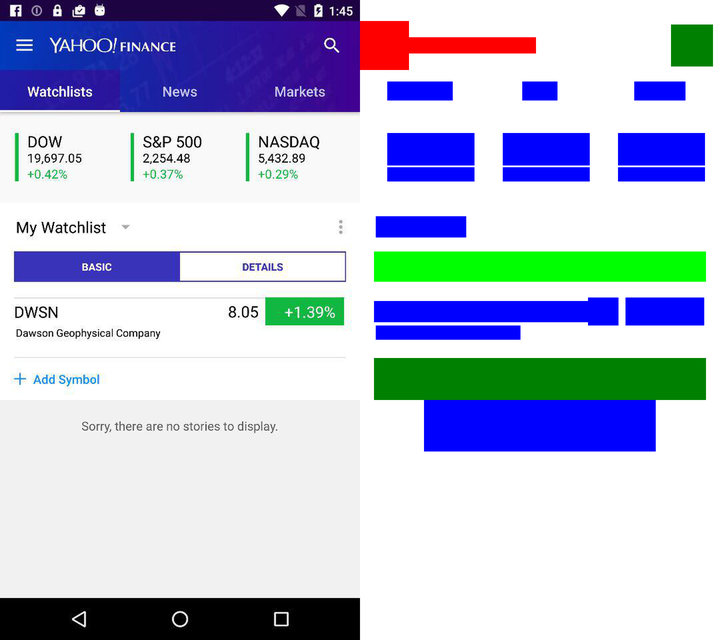

# JSON Processing of RICO Dataset

These scripts are used to process JSON layouts of [RICO dataset](http://interactionmining.org/rico).<br />
The result of processed layouts has been used in [a paper in CHI '20](https://dl.acm.org/doi/abs/10.1145/3313831.3376327).

## Scripts

We used python 3.6.2 to execute the scripts below.

### `python main.py`

This script extracts required metadata from the raw RICO json files, as a raw file contains too many information about the interface. <br />
RICO json files should be stored in `json/raw/` folder, and the results will be stored in `json/refined` folder.

### `python draw_image.py`

Using the refined json files produced by `main.py`, this script draws bounding boxes of layout components.<br />
You may find the mapping between colors and component categories in the `settings.py` file.<br />
The results will be stored in a `layout/{filename}_out.png` format.

### `python compare_org_draw.py`

This script draws the comparison image of a UI capture image and its layout image.<br />
The purpose of this comparison is because **a few RICO images do not match to their json hierarchy information**, so we had to produce the comparsion images and manually check if all the images are correct.

This script requires the original UI images in `original_picutre/` folder as well as the layout images produced by `draw_image.py`, and the results will be stored in a `comparison/{filename}_comp.png` format.

### `python compress.py`

This script compresses the drawn layout images produced by `compare_org_draw.py` script.<br />
The purpose of compression is because the dimension of a raw layout image is 2880 x 2560, which is a bit large.<br />
The results will be stored in a `compressed_comp/{filename}_{compress_ratio}compressed.png` format.

Here are a few examples of the produced outputs after `compress.py`, compressed by 4.0:
1462 | 3553 | 17059
---- | ---- | ----
 |  | 

### `delete.py {image_numbers}`

This script receives a list of RICO image numbers and deletes the data of them produced by the scripts above.

## Citation

If you found these scripts helpful, please consider citing our paper.
```bibtex
@inproceedings{lee2020guicomp,
  author = {Lee, Chunggi and Kim, Sanghoon and Han, Dongyun and Yang, Hongjun and Park, Young-Woo and Kwon, Bum Chul and Ko, Sungahn},
  title = {GUIComp: A GUI Design Assistant with Real-Time, Multi-Faceted Feedback},
  year = {2020},
  publisher = {Association for Computing Machinery},
  address = {New York, NY, USA},
  url = {https://doi.org/10.1145/3313831.3376327},
  doi = {10.1145/3313831.3376327},
  booktitle = {Proceedings of the 2020 CHI Conference on Human Factors in Computing Systems},
  pages = {1–13},
  series = {CHI '20}
}
```
